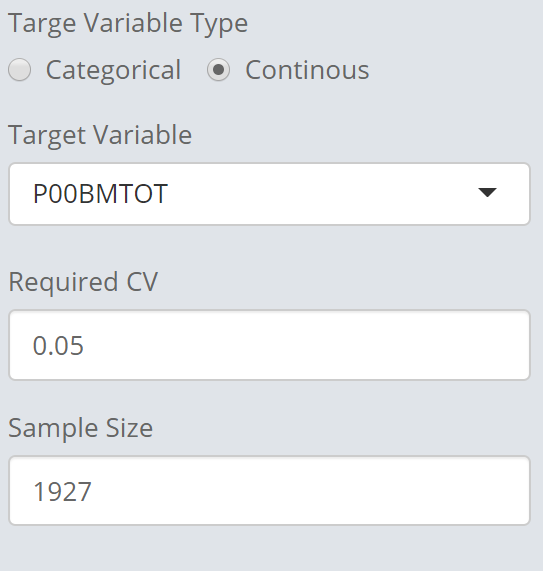

```{css, echo=FALSE}
    body .main-container {
      max-width: 640px !important;
      width: 640px !important;
    }
    body {
      max-width: 640px !important;
    }
    .caption {
      font-size: 70% !important;
    }
```


```{r, include = FALSE}
knitr::opts_chunk$set(
  collapse = TRUE, out.width = "100%", echo = FALSE,
  comment = "#>"
)
```


The COVID19 Sampling Toolbox is primarily intended for sampling from list frames with a rich set of auxiliary information. It is not intended to be used for any complex sampling design at this stage. 

The graphical user interface (GUI) is implemented in flexdashboard, with **runtime: shiny**, for more details see here: https://rmarkdown.rstudio.com/flexdashboard/shiny.html

Currently it contains two sampling approaches:

- **SamplingStrata**, which allows simultaneous creation of stratification and allocation of the required sample size for multiple domains and target variables. For more details please see [here](https://cran.r-project.org/web/packages/SamplingStrata/vignettes/SamplingStrata.html).
- **cube** method for [Balance Sampling](http://www.antongrafstrom.se/balancedsampling/), which produces a balanced sample after providing inclusion probabilities. For more details on the methodology please see [here](https://www.eustat.eus/productosServicios/52.2_balanced_sampling.pdf).

In the following i will only present the use of the two approaches, assuming that the user is familiar with the two approaches.

After installation, you can run the following commands:


```{r setup, eval=F, echo=TRUE}
library(SurveySolutionsCOVID19tools)
suso_covid19_samplingApp()
```


This will open the application in your default browser (recommended browser: MS Edge or Google Chrome) with the following start screen.

```{r start, fig.cap="Application Start"}

```

## Upload Sampling Frame

Uploading the frame is done through clicking on *Browse..*. The frame file has to be in **.csv** format, and should ideally contain only the variables used for sampling, which are:

1. The target variable(s), i.e. employment status
2. The domain variables (only for stratification, in case of balanced sampling you have to upload the frame and sample for each domain separately)
2. The variables used for stratification/balancing (see methods about requirements)

Another important requirement is that none of the variables used in any of the two approaches contains any missing values.

After uploading the available variables can be selected from the corresponding inputs.

```{r Upload, fig.cap="Application Upload."}

```

Next step is the selection of the desired sampling approach through the available radio buttons.

## Sampling Strata

**SamplingStrata** requires the specification of several input parameters:

1. Domain Variable
2. Target Variable(s)
3. Categorical variables used in the stratification
4. Continuous variables used for the stratification

### Domain Variable

Select the (single) variable specifying the desired domain for the estimation. These can be geographic domains (i.e. provinces) or socio-economic domains (i.e. gender). The more domains you provide, the larger the sample size will be. If you only require the desired precision at the national level, you domain variable should include only a single value (i.e. 1).

### Target Variable

After selection of the domain variable, you need to specify the variable of interest, which is: The variable for which you require estimates at the desired level of precision for each of the provided domains. After having done that, you will see the CV table to the right


```{r cv, fig.cap="CV Table for SamplingStrata."}

```

For each target variable, the table will contain a separate column, in the same order as the specified variables. The number of rows is determined by the number of desired domains. Each value in this table can be modified. This means, you can specify a separate CV for each domain and variable. In the following we change the desired CV from 5% to 1% for the first target variable only.


```{r strat_cv_mod, fig.cap="CV Modification to 10%\n for first target variable.", out.width="30%"}

```

After setting the target variables, it is now time to select the stratification variables. Currently the stratification only works for categorical variables, which need to be provided as numeric inputs. However you may also provide continuous variables, which are transformed to categorical. The transformation is described further down below.

Let's start with a set of categorical stratification variables for now.


```{r strat_cat_sel, fig.cap="Selection of\n Stratification Variables", out.width="30%"}

```


That's it. You can now start the stratification by clicking on the *Start Stratified Sampling* button.


```{r strat_start1, fig.cap="Stratification Start"}

```

A progress bar in the lower right corner will inform you, when the optimization is finished.

**Attention**: The application uses a genetic algorithm for the optimization, and depending on the number of domains/target variables, this may require substantial computational resources. The function supports parallel execution, however the availability depends on the number of (logical) CPU cores. If you system has 4 or less cores, the optimization will be carried out sequentially, and may take significantly longer to complete.

### Continuous Variables

In case were continuous variables are provided, a transformation to a categorical format is achieved by using the function:

```{r varbin, eval=F, echo=TRUE}
SamplingStrata::var.bin()
```

which requires the specification of the number of desired categories. The default to this is 3. Changing this parameter to an unreasonable number of categories may result in non-convergence of the optimization.

### Seed

For the purpose of creating reproduceable samples in both, the final sample as well as the random seed for the optimization, it is recommended to provide a seed value. Using this seed with the application, will allow you to always get exactly the same sample every time you run the stratification (assuming all inputs are the same). Therefore it is recommended, to write down the seed together with the sample after creation of the final sample.


### Minimum Number of units per stratum

For the final estimation it is helpful if you have at least 2 units in each stratum, however an increase of this parameter is recommended. Nevertheless be careful, since increasing it too much may result in non-convergence of the optimization.

### Evaluation of results

Selecting the Sample Properties section allows you too view the quality of the specified design, and if all restrictions on your CV are met. Currently the screen shows the CV for each variable, it's bias for the variables, and across domains, as well as total and domain sample sizes and number of strata. If your require this for a report, you may very well take a screenshot now.

```{r strat_eval, fig.cap="Stratification Evaluation"}

```

### Download

To download the data, switch to the Final Sample section, which includes the download button. 

```{r strat_dwl, fig.cap="Stratification Download"}

```


The download file is **.zip** compressed, and contains three files:

1. The original frame file, updated with the stratification IDs
2. The design file, containing all information about the design (i.e. domain, stratum id, sample size etc.)
3. The final sample including the weights.


## Balanced Sampling

Switching to Balanced Sampling requires selection of *Cube Sample* after uploading the file:


```{r cube_radio, fig.cap="Selection of Cube Sampling", out.width="30%"}

```

Which will also result in a slightly different set of inputs. 

### Target Variable


The first required step is the selection of a *single* target variable, either continuous ore categorical. If the latter, the categorical variable requires to be numeric, and coded with 0 and 1. After selection, and specification of the desired CV, The sample size window will contain the required sample size. This is only the theoretical one, in case you require more (i.e. to compensate for non-response), you may increase the value.


```{r cube_target, fig.cap="Target Variable and Sample Size", out.width="30%"}

```

### Balancing Variable(s)

In the final step you need to specify the balancing variables (i.e. the variables for which you require the means to be equal to the means of your frame population). Having done so, allows you to start the cube sampling algorithm.

```{r cube_balancingvars, fig.cap="Selection of Balancing Variables", out.width="30%"}

```

### Seed

Similar to the stratification, the provision of the seed allows your sample to be reproduceable.

### Download

After completion of the cube sampling approach, you can download the sample, the frame and the design in the last section, Final Sample.


```{r cube_download, fig.cap="Selection of Balancing Variables"}

```

The download file is **.zip** compressed, and contains three files:

1. The original frame file, updated with the stratification IDs
2. The design file, containing all information about the design (i.e. domain, stratum id, sample size etc.)
3. The final sample including the weights.


## Future Outlook

For the moment this is all, however check by frequently during the next days, since updates will follow. Current projects are:

- Include printable reports
- Simulation results for balanced sampling
- Survey Solutions API integration

In case of any questions or suggestions, feel free to drop me an [email](mailto:mwild@worldbank.org?subject=[GitHub]%20Covid19%20Sampling%20Tools).


